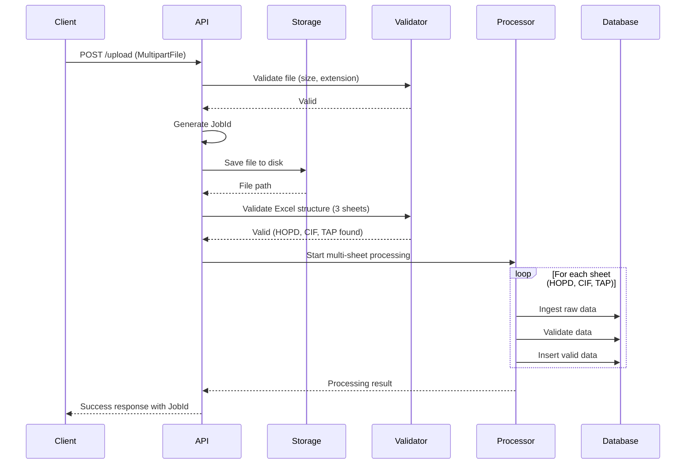

# Excel Upload API - User Guide

## 📤 New Upload API

### **POST /api/migration/multisheet/upload**

Upload Excel file with 3 sheets (HOPD, CIF, TAP) and automatically start multi-sheet migration processing.

---

## 📋 API Specification

### Endpoint
```
POST /api/migration/multisheet/upload
Content-Type: multipart/form-data
```

### Request Parameters

| Parameter | Type | Required | Default | Description |
|-----------|------|----------|---------|-------------|
| `file` | MultipartFile | ✅ Yes | - | Excel file (.xlsx or .xls) |
| `async` | Boolean | ❌ No | false | Process asynchronously |
| `testMode` | Boolean | ❌ No | false | Enable test mode |
| `testRowLimit` | Integer | ❌ No | null | Limit rows for testing |

### File Requirements

| Requirement | Value |
|------------|-------|
| **Max File Size** | 100 MB |
| **Allowed Extensions** | .xlsx, .xls |
| **Required Sheets** | HOPD, CIF, TAP (exactly 3 sheets) |
| **Sheet Names** | Case-sensitive: "HOPD", "CIF", "TAP" |

---

## 🚀 Usage Examples

### Example 1: Basic Upload (cURL)

```bash
curl -X POST http://localhost:8080/api/migration/multisheet/upload \
  -F "file=@/path/to/employees.xlsx" \
  -F "async=false" \
  -F "testMode=false"
```

### Example 2: Upload with Test Mode (cURL)

```bash
curl -X POST http://localhost:8080/api/migration/multisheet/upload \
  -F "file=@/path/to/employees.xlsx" \
  -F "testMode=true" \
  -F "testRowLimit=1000"
```

### Example 3: PowerShell Upload

```powershell
$uri = "http://localhost:8080/api/migration/multisheet/upload"
$filePath = "C:\data\employees.xlsx"

$form = @{
    file = Get-Item -Path $filePath
    async = "false"
    testMode = "false"
}

Invoke-RestMethod -Uri $uri -Method Post -Form $form
```

### Example 4: Postman

1. **Method**: POST
2. **URL**: `http://localhost:8080/api/migration/multisheet/upload`
3. **Body**: 
   - Type: `form-data`
   - Key: `file` (type: File)
   - Value: Select your Excel file
   - Add optional parameters:
     - Key: `async`, Value: `false`
     - Key: `testMode`, Value: `false`

### Example 5: JavaScript (Fetch API)

```javascript
const formData = new FormData();
formData.append('file', fileInput.files[0]);
formData.append('async', 'false');
formData.append('testMode', 'false');

fetch('http://localhost:8080/api/migration/multisheet/upload', {
    method: 'POST',
    body: formData
})
.then(response => response.json())
.then(data => {
    console.log('Upload successful:', data);
    console.log('Job ID:', data.jobId);
    console.log('Valid rows:', data.totalValidRows);
})
.catch(error => console.error('Upload failed:', error));
```

### Example 6: Java (RestTemplate)

```java
RestTemplate restTemplate = new RestTemplate();
String url = "http://localhost:8080/api/migration/multisheet/upload";

MultiValueMap<String, Object> body = new LinkedMultiValueMap<>();
body.add("file", new FileSystemResource(new File("/path/to/employees.xlsx")));
body.add("async", "false");
body.add("testMode", "false");

HttpHeaders headers = new HttpHeaders();
headers.setContentType(MediaType.MULTIPART_FORM_DATA);

HttpEntity<MultiValueMap<String, Object>> requestEntity = new HttpEntity<>(body, headers);
ResponseEntity<Map> response = restTemplate.exchange(url, HttpMethod.POST, requestEntity, Map.class);

System.out.println("Job ID: " + response.getBody().get("jobId"));
```

---

## ✅ Success Response

### HTTP Status: 200 OK

```json
{
  "jobId": "JOB-20241104-123",
  "originalFilename": "employees.xlsx",
  "filePath": "/home/user/excel-uploads/JOB-20241104-123_1730707200000.xlsx",
  "fileSize": 2457600,
  "uploadedAt": "2024-11-04T10:30:00.123",
  "success": true,
  "totalSheets": 3,
  "successSheets": 3,
  "failedSheets": 0,
  "totalIngestedRows": 150000,
  "totalValidRows": 145000,
  "totalErrorRows": 5000,
  "totalInsertedRows": 145000,
  "sheetResults": [
    {
      "sheetName": "HOPD",
      "status": "COMPLETED",
      "ingestedRows": 50000,
      "validRows": 48500,
      "errorRows": 1500,
      "insertedRows": 48500,
      "durationMs": 12500
    },
    {
      "sheetName": "CIF",
      "status": "COMPLETED",
      "ingestedRows": 50000,
      "validRows": 48500,
      "errorRows": 1500,
      "insertedRows": 48500,
      "durationMs": 11800
    },
    {
      "sheetName": "TAP",
      "status": "COMPLETED",
      "ingestedRows": 50000,
      "validRows": 48000,
      "errorRows": 2000,
      "insertedRows": 48000,
      "durationMs": 13200
    }
  ],
  "excelInfo": {
    "valid": true,
    "totalSheets": 3,
    "sheetNames": ["HOPD", "CIF", "TAP"],
    "requiredSheets": ["HOPD", "CIF", "TAP"]
  }
}
```

---

## ❌ Error Responses

### 1. Empty File (400 Bad Request)

```json
{
  "error": "File is empty"
}
```

### 2. File Too Large (400 Bad Request)

```json
{
  "error": "File size exceeds maximum limit of 100MB"
}
```

### 3. Invalid File Type (400 Bad Request)

```json
{
  "error": "Invalid file type. Only Excel files (.xlsx, .xls) are allowed"
}
```

### 4. Missing Required Sheets (400 Bad Request)

```json
{
  "error": "Excel file is missing required sheets: [TAP]",
  "foundSheets": ["HOPD", "CIF"],
  "requiredSheets": ["HOPD", "CIF", "TAP"]
}
```

### 5. Invalid Excel Format (400 Bad Request)

```json
{
  "error": "Invalid Excel file format: Zip file is corrupted"
}
```

### 6. Circuit Breaker Triggered (503 Service Unavailable)

```json
{
  "error": "Upload service temporarily unavailable. Please try again later.",
  "circuitBreakerTriggered": true,
  "details": "CircuitBreaker 'multiSheetMigration' is OPEN"
}
```

### 7. Internal Server Error (500)

```json
{
  "error": "Migration failed: Database connection timeout"
}
```

---

## 🔄 Complete Workflow



---

## 📊 Monitoring Progress

After uploading, use these APIs to monitor progress:

### 1. Get Overall Progress
```bash
GET /api/migration/multisheet/{jobId}/progress
```

### 2. Get Specific Sheet Status
```bash
GET /api/migration/multisheet/{jobId}/sheet/HOPD
```

### 3. Get All Sheets Status
```bash
GET /api/migration/multisheet/{jobId}/sheets
```

### 4. Check if Complete
```bash
GET /api/migration/multisheet/{jobId}/is-complete
```

### 5. Get Performance Metrics
```bash
GET /api/migration/multisheet/{jobId}/performance
```

---

## 📁 File Storage

Uploaded files are stored in:
```
{USER_HOME}/excel-uploads/
```

**File naming convention:**
```
{JobId}_{Timestamp}.xlsx
```

**Example:**
```
JOB-20241104-123_1730707200000.xlsx
```

---

## 🔒 Security & Resilience

### Rate Limiting
- **Pattern**: Token bucket
- **Limit**: Configured in `application.yml`
- **Behavior**: Blocks excessive requests

### Circuit Breaker
- **Pattern**: Resilience4j Circuit Breaker
- **State**: CLOSED → OPEN → HALF_OPEN
- **Fallback**: Returns 503 with retry message

### File Validation
- ✅ File size limit (100MB)
- ✅ Extension whitelist (.xlsx, .xls)
- ✅ Excel structure validation (3 sheets required)
- ✅ Sheet name validation (case-sensitive)

---

## 🧪 Testing

### Unit Test Example

```java
@Test
void testUploadValidFile() throws Exception {
    MockMultipartFile file = new MockMultipartFile(
        "file",
        "test.xlsx",
        "application/vnd.openxmlformats-officedocument.spreadsheetml.sheet",
        Files.readAllBytes(Paths.get("test-data/valid-3-sheets.xlsx"))
    );

    mockMvc.perform(multipart("/api/migration/multisheet/upload")
            .file(file)
            .param("async", "false")
            .param("testMode", "true"))
        .andExpect(status().isOk())
        .andExpect(jsonPath("$.jobId").exists())
        .andExpect(jsonPath("$.success").value(true))
        .andExpect(jsonPath("$.totalSheets").value(3));
}
```

### Integration Test with Real Excel File

```bash
# 1. Prepare test Excel file with 3 sheets
# test-data/employees.xlsx (HOPD, CIF, TAP sheets)

# 2. Upload and verify
curl -X POST http://localhost:8080/api/migration/multisheet/upload \
  -F "file=@test-data/employees.xlsx" \
  -F "testMode=true" \
  -F "testRowLimit=100" \
  | jq '.'

# 3. Check progress
curl http://localhost:8080/api/migration/multisheet/{jobId}/progress | jq '.'

# 4. Get performance metrics
curl http://localhost:8080/api/migration/multisheet/{jobId}/performance | jq '.'
```

---

## 📝 Excel File Requirements

Your Excel file **MUST** contain exactly 3 sheets with these names:

### Sheet 1: HOPD (Hợp đồng)
| Column | Required | Type | Description |
|--------|----------|------|-------------|
| ma_don_vi | ✅ | String | Organization code |
| ma_nhan_vien | ✅ | String | Employee code |
| ten_nhan_vien | ✅ | String | Employee name |
| ngay_bat_dau | ✅ | Date | Start date |
| ... | | | |

### Sheet 2: CIF (Customer Info)
| Column | Required | Type | Description |
|--------|----------|------|-------------|
| ma_don_vi | ✅ | String | Organization code |
| ma_nhan_vien | ✅ | String | Employee code |
| cif_number | ✅ | String | CIF number |
| ... | | | |

### Sheet 3: TAP (Training)
| Column | Required | Type | Description |
|--------|----------|------|-------------|
| ma_don_vi | ✅ | String | Organization code |
| ma_nhan_vien | ✅ | String | Employee code |
| khoa_dao_tao | ✅ | String | Training course |
| ... | | | |

**Note**: 
- Sheet names are **case-sensitive**
- All 3 sheets **MUST** be present
- Additional sheets are allowed but will be ignored

---

## 🎯 Performance Expectations

With optimized validation queries:

| File Size | Rows | Expected Time | Throughput |
|-----------|------|---------------|------------|
| 10 MB | 10K | ~1 second | 10K rows/sec |
| 50 MB | 100K | ~5 seconds | 20K rows/sec |
| 100 MB | 1M | ~30 seconds | 33K rows/sec |

**Note**: Actual performance depends on:
- Database performance
- Number of validation errors
- Master table sizes
- Server resources

---

## 🐛 Troubleshooting

### Issue: Upload returns 400 "Missing required sheets"
**Solution**: Verify sheet names are exactly "HOPD", "CIF", "TAP" (case-sensitive)

### Issue: Upload returns 503 "Service unavailable"
**Solution**: Circuit breaker is open. Wait 30 seconds and retry.

### Issue: File uploaded but processing fails
**Solution**: 
1. Check logs for detailed error
2. Use `GET /{jobId}/sheets` to see which sheet failed
3. Fix data issues in Excel file
4. Re-upload

### Issue: Upload hangs for large files
**Solution**: 
- Use `async=true` for files > 50MB
- Monitor progress with `GET /{jobId}/progress`

---

## 📞 Support

For issues or questions:
1. Check logs: `logs/application.log`
2. Review error response details
3. Contact development team

---

**Version**: 1.0  
**Last Updated**: November 4, 2024  
**Status**: ✅ Production Ready
